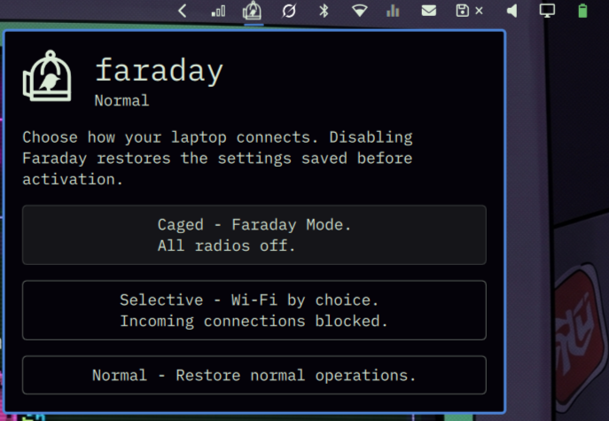

# Faraday

Faraday is a reversible laptop isolation widget for Omarchy Quattro designed
to provide network control for travel and untrusted public environments. It
simplifies RF management and firewall isolation without permanently altering
your system's existing configuration.



## The modes

- **Caged:** An offline mode that powers down all discovered Bluetooth adapters
  and soft-blocks discovered Wi-Fi, NFC, cellular/WWAN, and other rfkill radios.
  It drops network traffic except loopback and blocks routed and bridged
  forwarding. Coverage depends on the hardware and drivers exposing their
  radio controls; this is software isolation, not a physical Faraday cage.
- **Selective:** For deliberate Wi-Fi connections at coffee shops, airports,
  or hotels. Wi-Fi stays available, but autoconnect is disabled for managed
  Wi-Fi adapters and saved networks. Bluetooth, NFC, cellular, and other
  discovered radios stay off. The firewall blocks unsolicited incoming
  connections, Ethernet traffic, and forwarding, while allowing locally
  initiated Wi-Fi traffic, replies, and necessary network maintenance traffic.
- **Normal (Resume):** Turns Faraday off and restores the settings saved before
  lockdown, including radio power states and Wi-Fi autoconnect preferences.
  It removes Faraday's firewall tables; your original firewall rules remain
  in place throughout. Unavailable hardware or networks can require a restore
  retry, as described below.

Entering either active mode disconnects current Wi-Fi/cellular sessions.
In Selective, use **Choose a Wi-Fi network…** to select a connection in Omarchy's
network panel. Newly saved profiles are also journaled and have autoconnect
disabled. Switching modes keeps the first activation's snapshot.

Faraday controls radios and network isolation. Screen-lock timing, stay-awake,
and other desktop idle settings are outside its scope and are left untouched.

## How it works

- Faraday discovers radios through their sysfs bus locations rather than
  relying on transient IDs. Wi-Fi profiles are addressed by UUID, and Bluetooth
  adapters by address. Discovery never starts an inactive Bluetooth service.
- Before applying isolation, it creates an atomic, root-private journal at
  `/var/lib/faraday/snapshot.json` to record radio states, adapter flags,
  Bluetooth power states, active wireless connections, and Wi-Fi autoconnect
  preferences.
- Existing UFW, firewalld, Docker, and custom rules remain untouched. Faraday
  exclusively manages its own `inet faraday` and `bridge faraday` tables.
- Recovery is idempotent: completed steps are recorded, and failed steps can
  be retried. If reconnection fails during resume, Faraday retains the recovery
  journal with the original settings.

This repository includes the widget, original vector artwork, privileged
controller, installer, and tests. Faraday is an independent third-party plugin,
not an Omarchy-endorsed or audited security product. Version 0.1.2 is a
development release; see the validation limits below.

## Requirements & setup

There are no laptop models, radio counts, hostnames, SSIDs, interface names,
or user home directories hard-coded into the controller. It discovers devices
and identifies radios by their sysfs bus location, not transient rfkill IDs.
Wi-Fi profiles are addressed by UUID. A computer with no radios can still
use Caged mode.

Required platform:

- Linux with systemd and Omarchy's Quattro/Quickshell plugin API.
- Python 3.10+, NetworkManager, nftables with `inet` and `bridge` support,
  util-linux `rfkill`, and polkit with an authentication agent.
- Selective currently requires **wpa_supplicant**, not IWD. IWD has its own
  autojoin behavior; Faraday refuses Selective while IWD is running instead
  of falsely claiming autoconnect is disabled. Caged mode supports either.
- All Wi-Fi adapters must be managed by NetworkManager. Network managers such
  as standalone IWD or systemd-networkd need an additional backend.
- Firewall flowtable offload must be disabled; activation refuses detected
  nftables flowtables, which can bypass ordinary forwarding hooks.

Hardware kill switches cannot be overridden. Radios not exposed to Linux's
rfkill or NetworkManager APIs cannot be controlled or verified by this version.
Hotplug is reconciled by a polling monitor, not an instantaneous hardware barrier.

### Install locally

Clone the repository and run the installer:

```sh
git clone https://github.com/bprendie/faraday.git
cd faraday
./install.sh
```

The installer validates the plugin, installs the controller as root-owned code,
installs polkit and systemd definitions, and copies a symlink-free release into Omarchy's
plugin directory. It starts the monitor and enables the bar widget. **It does
not activate lockdown.** Privileged installation uses sudo in your terminal;
mode changes use the desktop's polkit authentication prompt.

Omarchy's plugin installer only installs the QML checkout. The separate helper
installation is still required; run `./install.sh` from the installed checkout.

The installer restarts the Omarchy shell after enabling the widget to discard
cached QML objects from older releases. When updating the helper manually,
finish with `omarchy restart shell` after installation/authentication completes.
A registry rescan alone may leave old widget timers alive.

For a read-only dependency check before installation:

```sh
python3 backend/faraday.py doctor
```

## Restore and recovery

The first activation saves an atomic, fsynced, root-private journal in
`/var/lib/faraday/snapshot.json` before making changes. It records radio blocks,
NetworkManager radio flags, Wi-Fi adapter and profile autoconnect settings,
previously active Wi-Fi/cellular connection UUIDs, and Bluetooth adapter power
states. New activations do not read or write desktop idle configuration.

Faraday owns only the `inet faraday` and `bridge faraday` firewall tables.
Existing UFW, firewalld, Docker, and custom rules are not rewritten. Turning
Faraday off deletes only its own tables. Recovery of snapshots created by
0.1.0/0.1.1 still restores any idle settings those older releases changed.

Restore operations are journaled and idempotent. Command results are read back
before reporting success. A missing adapter or failed step shows **Restore
incomplete** and keeps the snapshot for retry. The latest completed snapshot
is retained as `last-restored.json`, accessible only to root.

While restoration is running, an animated spinner shows the current step and
elapsed time. A separate heartbeat stays fresh while Bluetooth wakes up or
cellular reconnects. Bluetooth power changes are checked before writing and
given up to 30 seconds to settle; temporary transition failures are retried
inside the same operation. Old errors are cleared when retry begins. Real
failures are reported after the operation stops, with the snapshot retained.

If the widget is unavailable:

```sh
sudo /usr/local/libexec/faraday-helper off
```

An interrupted activation is reconciled by the monitor. After a reboot,
`faraday-boot.service` installs a Caged barrier before NetworkManager starts;
an active Selective session returns to **Caged**, retaining the original
snapshot. A restore already in progress stays pending for an explicit retry.
Do not remove the helper or snapshot while restoration is pending.

Restoring settings cannot recreate a removed adapter, an unavailable network,
deleted credentials, or terminated application sessions. Reconnection is
attempted for originally active Wi-Fi/cellular profiles; if it fails, the
controller retains the recovery journal. Already-connected profiles are left
connected; ongoing activations get time to finish. New activation attempts
allow up to 90 seconds for slower cellular modems. If an attempt still fails, the
remaining recovery state is retained. A previously absent/deleted profile is
never recreated from stored secrets—Faraday does not store Wi-Fi passwords.

If reconnection is the only failed step, the original settings and firewall
have already been restored. **Restore incomplete does not mean protection is
still fully active.** Inspect the reported failing step.

## Icons and interface

Open [the icon preview](assets/preview.html) in a browser to compare all five
states at 16, 20, 24, and 32 pixels. The bar uses themeable native QML drawing;
matching SVG files are available under `assets/`. The original generated
brainstorming image is saved in `assets/concepts/bird-cage.png`.

- Open door: Normal.
- Closed cage: Caged.
- Closed cage with Wi-Fi badge: Selective.
- Cage with activity mark: Applying.
- Cage with exclamation: failed control, stale monitor, or incomplete restore.

The popup supports Tab/Shift-Tab, Enter/Space, and Escape. Both shape and color
communicate state. A stale helper heartbeat never shows a healthy active icon.

## Development and verification

```sh
python3 -m unittest discover -s tests -v
node tests/test_model.js
./tools/test-firewall.sh
omarchy plugin validate "$PWD"
qmllint -I /usr/share/omarchy/shell Panel.qml CageIcon.qml
python3 tools/build_icons.py
```

The firewall test runs real packets inside unprivileged user/network namespaces;
it does not touch the host's firewall, interfaces, radios, or connections. It
checks IPv4/IPv6 incoming and outgoing behavior, existing inbound sessions,
loopback, restored connectivity, and preservation of unrelated firewall rules.

The controller tests use simulated devices and injected failures. They cover
mixed initial states, mode switching, durable snapshots, restore retries,
hotplug, renumbered radios, missing devices, crash recovery, reboot handling,
unrelated config edits, and successful-command/failed-readback cases.

Physical radio switching, Selective Wi-Fi, and restoration have been manually
tested on one laptop. **Not yet validated end to end:** complete
installation/activation/restoration on a disposable machine, reboot ordering
with every firewall manager, and hotplug/service restart races. A full VM and
hardware acceptance pass is required before relying on this at an event.
See [architecture and limits](docs/architecture.md) for the exact boundary.

## Uninstall

First select Normal and wait for successful restoration, then close the popup:

```sh
./uninstall.sh
```

The uninstaller refuses removal while an operation, recovery snapshot, or
Faraday firewall table remains. It stops/disables both system services, removes
only Faraday's installed helper, units, and polkit policy, then disables the
widget and restarts the shell. It retains the disabled plugin folder and private
recovery journals. You can then remove the plugin through Omarchy's plugin
management. Removing or disabling the widget alone does **not** restore network
settings or uninstall the privileged controller. Never delete an active snapshot
to silence an error.

Installation preserves an existing managed plugin copy under `~/.config/omarchy/faraday-backups/` (or the corresponding XDG config
directory). Move that `.previous` backup before another upgrade.
When working directly in a real plugin checkout, installation keeps that checkout.
Development output, caches, and Git metadata are excluded from copied releases.

See [publishing readiness](docs/publishing.md) for the marketplace checklist.

MIT licensed.
